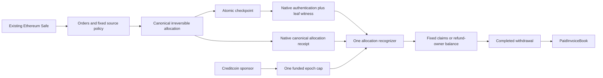

# Work Treasury architecture lock

Frozen on 9 September 2026. This repository snapshot reproduces the normative implementation and acceptance sections (1–11) of the consolidated architecture lock. Historical competitor scores and planning discussions are outside this specification. Implemented and observed status is recorded separately in [the release ledger](RELEASE-GATES.md); a requirement here is not evidence that it has passed.

## 1. Components and authority

| Component | Responsibility |
|---|---|
| Ethereum SourceCoordinator | Epoch reservations, binding work consent, delivery/revision, WorkPolicyV1 decisions, canonical allocation append, checkpoint publication |
| Creditcoin WorkTreasury | Exact funded epoch, native evidence authentication/cache, one allocation recognizer, reserve/claim/free-balance accounting and withdrawals |
| Wallet/Safe application and replaceable proof worker | Quotes, ordinary Safe calls, independent target funding reads, resumable work, evidence preparation/export and recovery |
| Independent evidence inspector | Reconstruct source outcomes and trees; distinguish authentic evidence, application meaning, missing provenance and actual payments |
| Separate PaidInvoiceBook | Consume only completed WORK withdrawals for its expected buyer/order/asset/policy, without custody powers |

The source Safe uses ordinary calls to the coordinator. Install no ProofKey Safe module or guard. Its existing owners, modules and governance remain its authority boundary; source Safe control is not a permanently frozen quorum. Source contract-wallet signatures are checked on Ethereum, never treated as current EIP-1271 authorization on Creditcoin.

The target sponsor, source Safe, source worker signer, target claim owner and initial payout destination are distinct roles. Signed terms bind each expressly. The target sponsor chooses an immutable `refundBeneficiary`, defaulting to itself. The source Safe has bounded purchasing authority; it cannot redirect that refund, move target free balances or execute arbitrary target calls.

Pin immutable coordinator and treasury deployments, policy/schema versions and native decoding configuration. Existing epochs and orders cannot be upgraded to changed rules. Additional versions apply to fresh epochs. Deployment manifests must identify chains, native chain-key mapping, contract addresses, source/library hashes and deployed bytecode correspondence before release.

## 2. Epoch funding, identity and consent

An epoch is one finite purchasing cycle. Its immutable ID commits both EVM chain IDs, the native source-chain key, source coordinator/version, target treasury/schema, source Safe, sponsor, refund beneficiary, target asset, cap, policy version, source initialization/admission cutoffs, all capacity limits and sponsor-scoped nonce. A native chain key is not an EVM chain ID. Both contracts derive the same ID from canonical typed configuration and validate their own chain/address context.

Native CTC is the only initial accounting asset; the target asset sentinel is `address(0)`. Amounts are integer base units. Testnet demonstrations use tCTC. No conversion oracle, token bridge, lending or price-based collateral is introduced.

The sponsor funds that exact cap once on Creditcoin. One operation can credit a native deposit and reserve the cap from the sponsor's free balance; a previously credited free balance can also fund a new epoch with its owner's authorization. Never reserve another account's free balance. Duplicate funding of the same epoch is rejected. Extra credited free money, if allowed by the funding API, is not extra epoch capacity.

The source Safe can initialize and reserve orders within that cap. Each target claim must belong to an actually funded, exact target epoch; a source event alone cannot create funding. Initialization is permitted only before the source initialization cutoff. Anyone can materialize a never-initialized configuration's expiry at or after that cutoff: record it irreversibly expired, append its whole-cap RETURN to the committed refund beneficiary and publish a checkpoint. It cannot later initialize. Such an event has no economic effect on Creditcoin unless the exact epoch was funded there.

**No reverse funding proof is claimed.** Under the selected one-way integration, Ethereum cannot determine whether Creditcoin funding occurred. The official app independently reads finalized target funding, exact cap/configuration and remaining capacity before requesting a binding worker signature, and checks again before work. A pasted transaction hash or caller-supplied `funded=true` is not proof.

Drafts are off-chain, unsigned and non-authorizing. They reserve no money or admission slots and cannot be passed to the binding acceptance validator. A source-side pending offer, if created, is an explicit Safe-authorized reservation under complete terms, not a draft or proof of funding. It has an acceptance cutoff and expiry/decline behavior. A vendor-signed binding quote can be accepted by the Safe in one source operation that reserves the order and records agreement; alternatively the worker can accept an existing pending offer. Both use the same reservation and agreement state transitions.

A binding quote/order commits the epoch, complete scope/terms hash, source authorities, target owner/destination, bounded milestone list, worker/fee amounts, policy and committee parameters, source cutoffs, nonce and expiry. Source IDs are scoped to that configuration/authority. Consumed, expired or revoked quote nonces cannot authorize another order. A caller bypassing the app can still agree unfunded source work; the source must not label that agreement cryptographically funded.

## 3. One complete work policy: WorkPolicyV1

Keep one built-in policy with no arbitrary policy plug-ins or post-consent edits. Its version is pinned by the epoch; each order ID binds its exact parameters. Every reservation has one source-final outcome. Changed scope or a higher worker maximum requires another accepted order.

An order commits `tAccept`; each milestone commits `tDeliver`, `tReview`, `tRule` with `tAccept < tDeliver < tReview < tRule`. All are source-block cutoffs. Let a milestone reserve be `M = W + F`: worker maximum W and optional fixed adjudication-fee reserve F. There is at most one WORK and one FEE allocation per milestone. One precommitted fee owner/destination receives F only after a valid committee ruling. The order fixes three distinct committee addresses, a 2-of-3 quorum, and `timeoutWork` in `[0,W]`. F may be zero.

| Condition | Authorized source action | Exact result |
|---|---|---|
| Pending, never agreed | Either designated party declines; anyone expires at block `>= tAccept` | Release its reserved M from U to A; no worker entitlement |
| Pending before `tAccept` | Worker accepts exact Safe offer, or Safe accepts exact worker quote | Agreement becomes binding once |
| Agreed, nonterminal, unchallenged, block `< tDeliver` | Worker delivers or revises | Update delivery/state version; no allocation |
| No delivery, block `>= tDeliver` | Anyone finalizes no-delivery | M moves U→A |
| Delivered, unchallenged, block `< tReview` | Buyer approves current delivery | WORK=W; unused F moves to A |
| Delivered, unchallenged, block `< tReview` | Buyer challenges current delivery | Freeze delivery; hold M in U for adjudication |
| Delivered, unchallenged, block `>= tReview` | Anyone finalizes monitoring default | WORK=W; unused F moves to A |
| Challenged, block `< tRule` | Fixed 2-of-3 quorum approves an exact allocation | WORK=w in `[0,W]`, FEE=F, `W−w` moves to A |
| Challenged, block `>= tRule` | Anyone finalizes agreed committee-timeout fallback | WORK=`timeoutWork`; `W−timeoutWork+F` moves to A; no fee |
| Agreed and nonterminal, even after a cutoff until another result finalizes | Both source parties authorize the same current mutual proposal | WORK=w in `[0,W]`; `W−w+F` moves to A; no fee |

Terminal rows remove M from U exactly once and satisfy `M = work + fee + restoredAvailable`. Only positive WORK/FEE amounts append payment leaves. A zero-earning outcome still records immutable finality but can append zero leaves. No-delivery does **not** automatically create RETURN; preserving U→A is what allows repeated procurement.

Votes and mutual proposals bind epoch/order/milestone, current delivery and state version, exact split, policy and a proposal nonce. Distinct proposals cannot pool votes; duplicate voters do not count. Superseded/revoked proposals and signatures for prior states fail. A competing terminal outcome invalidates every later proposal. Delivery/challenge changes advance the semantic state version; merely collecting a vote must not accidentally invalidate the other votes for that same proposal. Mutual settlement has no priority over an already available default: whichever valid source transition finalizes first wins.

The buyer accepts a monitoring obligation under the unchallenged-delivery default. The agreed timeout split assigns committee-availability risk. Neither is proof of work quality or universal fairness. Three addresses do not demonstrate independent humans. Committee judgments are authenticated source decisions, not independent native oracles.

Retain these branches in the completed product. The 120-unit main demonstration can omit committee voting for clarity; separate public branch evidence must cover quorum, duplicate/stale vote rejection and committee timeout. Removing adjudication without specifying a replacement would leave challenged work dependent on mutual agreement.

## 4. Budget lifecycle and conservation

Source accounting is always:

`C = A + U + E + R`

C is the immutable cap; A is available purchasing capacity; U is unresolved reservations; E is irreversible WORK/FEE allocations; R is irreversible RETURN allocations. Opening an actual reservation moves A→U. A terminal outcome moves U into E and/or A. E and R never become available again.

- **ACTIVE:** before the admission cutoff, accept new reservations within money and slot capacity. The Safe may `releaseFree(x)` for positive x≤A, producing a RETURN to the fixed refund beneficiary.
- **DRAINING:** the Safe stops admissions, or anyone starts draining after the cutoff. Admit no new reservations. Existing pending/agreed obligations retain their original consent and deadlines. Anyone may sweep all positive A into RETURN as outcomes restore it.
- **CLOSED:** A=U=0 and E+R=C. No resurrection or additional local close refund. Old earned allocations remain collectible.

RETURN is an epoch-level A→R release and can aggregate money from multiple outcomes. An empty sweep appends nothing and consumes no positive-return quota. A phase transition alone creates no payment. All source operations complete their updates before exposing a snapshot; no reentrant callback can publish intermediate accounting.

Target accounting uses cumulative recognized amount P across every kind, including already withdrawn/released allocations:

`epoch reserve = C − P`

`credited deposits = free balances + epoch reserves + unwithdrawn claims + cumulative withdrawals`

The actual target balance covers all live liabilities. Forced surplus is not arbitrarily credited. The shared recognizer requires `P + amount <= C` and moves value from exactly that epoch's reserve. WORK/FEE create exact pull claims; RETURN credits the immutable refund owner's free balance. No target-local timeout, `C−E` close payment or refund of unseen reserve is allowed. Network gas paid by callers is separate from these budget amounts.

## 5. Capacity is part of the financial guarantee

Initial immutable configuration: depth-7 ordered tree, 128 leaf slots, at most 32 cumulatively reserved milestones, at most two earned leaves per milestone, 16 ACTIVE early returns, at most 33 positive all-A draining sweeps, and one protected final return slot. The conservative bound is `64 + 16 + 33 + 1 = 114 <= 128`.

**Every A→U milestone reservation counts toward 32**, including offers later declined or never agreed. Refunds do not replenish admission count. Off-chain drafts, failed calls, outcome records and checkpoint publication do not consume leaves. The 33 sweep bound follows from one initial free-balance sweep and at most 32 one-time U→A releases after draining starts. The extra closing slot is overprovisioned capacity, not an extra right to return money.

Before a reservation or early return is admitted, reserve enough future slots for all unresolved milestones' worst-case WORK/FEE outcomes and protected returns. A sequence of tiny early releases cannot exhaust the ability to honor accepted work or return remaining free budget. Keep this invariant in executable CI.

The application shows remaining money and remaining admission capacity before consent. Test exhaustion while money remains: new reservations fail without harming existing obligations; ordinary returns still work; a successor requires explicitly authorized target funding and fresh identity. Old unresolved reserve never transfers automatically, and old claims retain their original epoch. “Fund once” means once per finite epoch. Larger future configurations require new validation and fresh epochs.

The 114 bound reserves safety headroom; it is not a claim that 114 positive allocations are reachable. Under these fixed rules, an initialized epoch reaches at most 113: 64 earned leaves, 16 ACTIVE returns and 33 draining returns. The final all-A sweep already closes the remaining available balance; the extra protected slot cannot create a second payment of it. A separate stress trace uses cap 120: reserve 32 milestones of W=2/F=1, leaving A=24; release sixteen ACTIVE returns of 1; start draining and sweep the remaining 8; then rule each challenged milestone at WORK=1/FEE=1 and sweep its restored 1. That yields 113 leaves, E=64 and R=56. Exercise this through real policy/append calls. Test 114 and 128 entries separately through the production tree implementation in a harness; do not invent a zero-value or duplicate RETURN to reach an impossible business trace.

## 6. Frozen allocation ABI and ordered tree

The normative schema and synthetic encoding vectors are published in [schema-v1.json](../schema/schema-v1.json) and [schema-v1-vectors.json](../schema/schema-v1-vectors.json). They freeze ProofKey's allocation/checkpoint ABI and hash domains, not a fabricated native runtime version.

Exact reproduction passed, with ethers and Foundry agreeing on 37 encoding/hash comparisons and the three synthetic ordered proofs. These are application codec fixtures, not executed contracts or native proofs. The canonical epoch-configuration, order and policy-content codecs must be specified and tested before implementing their signature/identity checks; the allocation schema does not replace those commitments.

`AllocationV1` includes epochId, allocationId, treeIndex, kind, orderId, milestoneId, role, target asset, amount, claimOwner, destination, policyHash and evidenceHash. The full event carries every field, including fields represented as indexed topics. Do not replace it with a hash-only or truncated event to save gas: receipt recovery requires the complete canonical allocation.

Only `bytes32 epochId` and `uint64 allocationId` are indexed. Both are static value types recoverable directly from their topics. The other eleven fields occupy exactly 352 data bytes, with three topics including the signature. Reconstruct the full typed allocation from **topics plus data**, then re-encode and hash it exactly as the append routine did. V1 has no indexed dynamic/complex payload and does not duplicate the indexed values in data. Require a real emitted-event-to-stored-allocation-to-leaf-hash roundtrip in the implemented contract, beyond synthetic ABI fixtures. [Solidity event encoding](https://docs.soliditylang.org/en/latest/abi-spec.html#events).

The sole append routine assigns `treeIndex = current leafCount` and `allocationId = treeIndex + 1` within the epoch, then advances the count. ID zero is invalid; IDs never reset and never come from relayer calldata. Both evidence forms enforce this relation and index below the configured capacity. All WORK/FEE/RETURN share this sequence.

Kinds/roles are fixed: WORK=1/worker role=1, FEE=2/fee role=2, RETURN=3/epoch role=0. Amounts and owner/destination are nonzero. WORK/FEE have a nonzero order ID and fields drawn from accepted terms. RETURN uses orderId=0, milestoneId=0 and the refund beneficiary as owner and canonical destination. Asset/policy match the funded epoch; the order ID binds order-specific policy parameters. Reject unknown kinds, noncanonical padding, wrong topic/data length and alternative sentinel encodings.

Leaf hashing uses its exact published type hash and ABI encoding of all fields. Internal nodes and empty leaves have distinct published domains. The tree is ordered, not sorted-pair; the index determines left/right at each level. Checkpoint membership requires exactly seven siblings and index below the authenticated leafCount. The evidence hash commits typed source outcome/release content, not its own future transaction hash or current log ordinal. Off-chain provenance locators can identify that content afterward without circular hashing.

## 7. Atomic publication and safe republishing

Every allocation-producing coordinator call completes all appends, A/U/E/R, count/root and phase updates, then emits `CheckpointPublished(epochId, root, leafCount, earned, returned, phase)` before returning. WORK+FEE share that call's completed snapshot. An allocation cannot successfully commit while its required checkpoint is omitted or reverted. Separate coordinator calls in an outer Safe batch may produce several valid prefix checkpoints; no transaction-global end hook is assumed.

`republishCheckpoint(epochId)` is permissionless and accepts no root, leaf array, cap, counters or phase. It requires an initialized or irreversibly expired epoch and emits the **current stored canonical** root/count/E/R/phase. It changes no financial state, allocation ID, deadline or capacity. It need not rehash the entire tree on-chain. Public bounded getters and the independent inspector rebuild stored leaves in canonical order and verify the maintained root.

After one-time canonical empty-tree initialization, only the internal append routine may write the allocation leaves, count or tree root/frontier. No administrator, republisher or alternate settlement path can replace them. The source retains every full canonical allocation, not just a running root. Minimum permissionless read surface: `allocationAt(epochId, treeIndex)` returning AllocationV1, `leafHashAt(epochId, treeIndex)`, and `epochState(epochId)` returning leafCount/root/A/U/E/R/phase. Allocation reads reject indices outside leafCount; the immutable epoch configuration is separately readable. The inspector pins all reads to the same finalized source block and independently rebuilds the complete ordered tree from those full allocations. Getter state is recovery material, not native payment authentication.

Independent reconstruction detects a bad root; it does not repair or prevent one. Before release, compare it with the real contract's stored root after every successful operation in the 113-leaf policy trace and with the published snapshot after every allocation-producing call. Use a reconstruction implementation that does not call the production incremental updater. Test the exact production append/tree code in a harness through 114 and 128 leaves, every power-of-two carry boundary including 127→128, and rejection of append 129 without changes. Check ID=index+1, domains/empty nodes, ordered sides, full getters, WORK+FEE sharing the completed snapshot, and reverted calls leaving no durable logs, leaf/count/root or accounting changes. Hand-seeded roots or codec-only fixtures cannot satisfy this gate.

An unchanged state republishes the same payload at a new source position. A phase-only change may preserve root/count/E/R. Republishing current state is sufficient; no arbitrary old-prefix publishing interface is added. All previously authenticated roots remain valid. Old/new arrival order must not overwrite cumulative target P or reject legitimate old leaves because a newer allocation has already been recognized. Root metadata and the latest UI phase are separate concerns; an old receipt cannot rewind the displayed latest authenticated source state.

## 8. Two evidence forms, one recognizer

1. **Checkpoint evidence:** native-authenticate the source checkpoint receipt, then verify the exact allocation's ordered inclusion witness.
2. **Canonical receipt evidence:** native-authenticate the exact `AllocationCreated` log emitted by the pinned append routine, or reuse its exact existing target authentication record. No prior root or application-tree siblings are required.

Both feed the same internal allocation recognizer: permanent ID and full leaf hash, source/target/epoch binding, asset/policy/kind/owner/amount checks, one P/reserve update, one claim or free-balance credit and one withdrawal mechanism. A source quote, generic approval or four-receipt work graph cannot independently create or recalculate an entitlement. A common replay mapping does not repair a wrongly accepted first amount; each adapter must establish the canonical first leaf.

Both forms rely on the same pinned source ledger enforcement and native receipt authentication. A co-published checkpoint is not itself proof that an allocation log belongs to that root. Receipt recovery gains different data requirements, not independent adjudication.

**Three identities remain distinct:**

- Authentication cache: dedicated domain + native source-chain key + authenticated block height/transaction index + pinned encoding/decoder profile + hash of the exact native `encodedTransaction` bytes.
- Selected log: that authenticated source position + **receipt-local log ordinal** + actual emitter. Ethereum RPC block-global `logIndex` is not interchangeable with receipt-local ordinal.
- Economic right: `(epochId, allocationId)` across receipts, roots, proof refreshes and both evidence forms.

Derive transaction position from the successfully authenticated native proof, never an unchecked caller assertion. Hash the exact bytes consumed by the decoder, not a reserialized receipt or transaction hash. A cache hit skips native authentication only; it still decodes/selects the log and checks receipt success, ordinal bounds, canonical topic/data shape, pinned emitter, version and full epoch domain. Authenticate WORK and FEE as distinct logs; callers cannot relabel one as the other. Batch and segmented native entry points share this authentication layer.

The native-derived transaction index and the selected log ordinal have different origins. A caller may supply the receipt-local ordinal as a selector; the parser bounds-checks it and extracts the actual log at that position from the authenticated decoded receipt. The native transaction-index primitive does not return the chosen log ordinal. Test a transaction containing unrelated earlier logs and multiple epochs, where block-global RPC log indices differ from receipt-local positions. Relabeling or supplying fabricated decoded fields must fail. Selecting a different genuine eligible allocation may succeed only as that allocation, under its own canonical identity and owner.

`authenticateAndRecognize` composes import and recognition. On success it has the same economic effect as separate successful calls. An invalid combined claim rolls back its newly created authentication/cache state; an earlier separately committed authentication survives a later failed claim. Explain this in NatSpec and show “This transaction saves a new checkpoint only if its claim succeeds” when the selected operation creates a new checkpoint. Previously authenticated facts are not silently described as newly verified.

## 9. Withdrawals, recovery and the consumer

`withdrawFor` is permissionless only to the fixed destination. The target claim owner alone can call `withdrawTo` on Creditcoin to choose an alternative. RETURN free balances have the equivalent owner-authorized alternate-destination withdrawal. The source Safe, inspector and relayer cannot redirect either. The app must establish a usable target wallet path before advertising independent recovery; a source EIP-1271 signature or simulation with an arbitrary `from` is insufficient.

The accepted terms grant standing permission to complete payment to the fixed destination. `withdrawTo` redirects only an unpaid claim and has no priority over a successful `withdrawFor`; the first successful valid withdrawal finalizes it. A rejecting destination leaves the claim recoverable, but a destination that successfully accepts and then locks funds does not. Before binding acceptance, the app defaults the destination to the demonstrated usable target owner where appropriate, validates the destination on the target chain and requires explicit acknowledgement of any different destination and this standing payment permission. Record the evidence of current control/spendability and expose what remains unknown; a successful transfer, zero code size or wallet simulation alone does not prove future recoverability. An unverified destination must not be presented as independently recoverable. V1 adds no separate payment-disable or pending-redirection priority feature.

Recognition and withdrawal are separate. Each WORK/FEE claim uses one full successful withdrawal, with effects-before-interaction, nonreentrancy and rollback on failure. A rejecting recipient preserves its claim and cannot block others. RETURN is recognized once into the refund owner's fungible free balance; that balance can be withdrawn or used to fund a successor epoch under the ordinary owner-authorization rules, without a per-RETURN withdrawal. A sponsored fixed-destination payout does not imply every action is gasless or a relay is always available.

Export two portable claim forms: cached-root reference plus full leaf/siblings; or the entire exact native `encodedTransaction` bytes containing the canonical allocation log, its receipt-local ordinal, and a usable native proof or existing target receipt-authentication reference. Event/leaf bytes alone do not supply the native transaction input. Regenerate aged continuity when possible. Republish current source storage when old receipts are unavailable. If application siblings/getters are missing but native allocation-receipt evidence survives, use receipt recognition. If new proof service access is unavailable but a cached root/witness or exact authenticated receipt/bytes survives, use that cached evidence.

Source publication alone does not guarantee finality, attestation or data availability. With neither usable evidence form, unresolved or unimportable outcomes can remain delayed indefinitely. No new trusted oracle or unilateral local refund is added to conceal that dependency.

PaidInvoiceBook reads a pinned treasury's completed WORK withdrawal for its expected buyer/order/asset/policy and records it once. It rejects pending claims, FEE, RETURN, unrelated buyer/order and duplicates. Record the entitlement owner and actual paid destination. Released budget is not already withdrawn; a payment is not proof of quality, independent parties, income sustainability or creditworthiness. The optional provenance inspector reports missing material honestly and never becomes another authorization or payment route.

## 10. Application and public demonstration

The homepage starts with the economic journey and live/readback evidence, not the architecture diagram. The operator workspace shows the responsible actor and next authorized action: quote, Safe authorization, delivery, challenge, ruling, checkpoint/receipt readiness, missing evidence, available claim and completed payment. Distinguish source status, target funding, recognition and withdrawal. Stale/unavailable data is explicit; the browser clock cannot finalize a refund.

The principal demonstration uses a 120-unit epoch:

1. Reserve A=30 and B=40; 50 remains available.
2. Finalize A's 30 earnings but delay its target recognition.
3. Release the available 50; authenticate and recognize that RETURN while B remains unresolved.
4. Mutually settle B at 25 earned and 15 restored to source A.
5. Commission C using that 15 with no new Creditcoin reservation transaction.
6. Expire C without delivery: first U→A, then an authorized release/draining sweep creates RETURN=15.
7. Authenticate the final checkpoint and recognize that RETURN before delayed worker collection. Source totals are E=55, R=65.
8. Stop new proof-service access. Use exported evidence under the cached root to collect workers' 55. PaidInvoiceBook accepts only completed WORK transfers.

Final accounting is 55 to workers plus 65 released/withdrawn for the refund beneficiary. On a separate fixture, retain a native allocation receipt proof for a noninitial tree leaf, withhold application siblings and disable source getters/history: root-only recognition cannot proceed, while exact receipt recognition can. Demonstrate both directions of cross-evidence replay refusal. This separates the two recovery claims clearly.

Require two consented independent settlements, with keys, funding, assistance and relationships disclosed, plus repeat operation without a target reservation operator. A team-controlled Safe is labeled controlled. A real buyer's reason to retain Ethereum authority while funding Creditcoin is sought and recorded, never invented. A controlled owner-change scenario must invalidate a formerly sufficient approval set and permit the new authorized set without mirroring owners on Creditcoin; old allocations remain collectible. Existing Safe module authority stays disclosed.

## 11. Implementation sequence and acceptance gates

Build in this order: frozen codecs and identities; conserved source/target kernel; all WorkPolicyV1 terminals; actual native adapters and persisted cache; Safe/wallet operation and recovery; PaidInvoiceBook; public and independent evidence. Implementing ordinary paths first does not remove the remaining policy branches from this lock.

| Gate | Required observation |
|---|---|
| ABI/codec | Published full leaf/event vectors, canonical padding/length refusal, ordered-tree reconstruction, separate domains and ID=index+1 across both adapters |
| Source policy | Every terminal conserves M; U is released once; pending expiry, no delivery, approval, monitoring default, quorum, committee timeout and mutual settlement all execute with boundary/stale/duplicate refusals; both mutual/default transaction orderings preserve the first valid terminal |
| Capacity | Reachable 113-leaf trace through actual policy/append; separate declined/unagreed, tiny early-return and late-draining traces; accepted obligations and protected returns remain appendable |
| Incremental tree/readback | Independent rebuild from same-block public full allocations equals real stored root after every operation; actual emitted-event roundtrip; production tree harness covers 114/128, carry boundaries and append-129 refusal; no hand-seeded substitute |
| Atomic publication | Multi-leaf calls publish their final consistent root; no later source transaction is needed to prove a new allocation; reverted calls leave no partial state/logs |
| Republish | Same-state payload equality, changed/phase-only state correctness, no caller root or repair input, no financial/leaf mutation, and independent full-leaf rebuild matches storage |
| Native necessity | Without a valid native authentication or matching persisted record, plausible checkpoints/allocations cannot introduce claims; authentic evidence for the wrong application fact also fails |
| Persisted cache | Warm with epoch A; reject same-receipt foreign-emitter look-alike and B-as-A; accept genuine B correctly without another native call; receipt-local selection differs from block-global logIndex; test both parsers and preserve state after failures |
| Evidence equivalence | Receipt→root and root→receipt/new-root replay cannot duplicate value; reject wrong first amount/kind/owner/domain/index and verify mixed WORK/FEE/RETURN |
| Accounting/recovery | RETURN-before-unseen-WORK preserves both claims; rejecting recipients do not block other payouts; target-owner redirection succeeds for claims and free balances; accepting-fixed-destination-first and owner-redirection-first each pay exactly once, and later attempts fail; a fixture that accepts and locks funds demonstrates the stated absence of post-payment recovery |
| Combined operations | Successful combined/separate flows have identical financial results; their documented failure/cache atomicity differs correctly |
| Availability | Show cached collection without new native proof and native-receipt collection without application siblings; show unavailable cases honestly |
| Performance | Publish source allocation/tree cost, marginal allocation/checkpoint event cost, target costs and actions for 1/4/16/32 claims through both forms; include first writes, carry boundaries, late tree, WORK+FEE and largest supported source batch |
| Product | Full 120-unit journey, capacity exhaustion/successor funding, wallet resume, proof-provider replacement and owner-change scenario are operable without private instructions |
| Consumer/users | Separate consumer rejects nonpayments; two consented independent settlements and repeat operation disclose actual assistance and control |

Freeze measured transaction bounds before deployment. Compact encodings only through a versioned schema revision and regenerated vectors; never silently truncate the allocation event or drop atomic publication. No complexity notation or test-count target substitutes for these observations.

Every gate is a release requirement. Maintain a manifest linking each required observation to the source revision, compiled artifact, reproducible test/run and observed result; public branch/native evidence additionally records chain, deployment and transaction/receipt identifiers. Ordinary-path demonstrations cannot substitute for challenge/quorum/timeout, stale/duplicate or ordering evidence. Mark unimplemented or unexecuted gates pending. None of the new real-contract, native, race or full-size tests is claimed passed by the schema fixtures or this planning amendment.

The existing 54,586-state / 300,847-transition abstract model supports only its stated accounting, cached-prefix replay and slot invariants. It does not verify Solidity, native decoding, exact Merkle implementation, signatures, Safe control, fee/recipient behavior, receipt recovery, ABI equivalence, reentrancy or the consumer. New release gates remain mandatory. The earlier abstract model is historical design evidence, not implementation release evidence.
